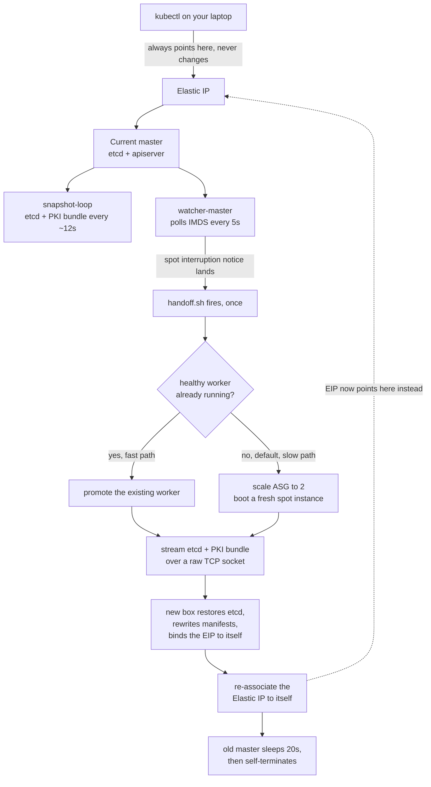

# eks-killer

$72 a month. For a control plane. That you never even touch.

EKS bills $0.10/hr for the control plane alone. That's $72/month, forever,
per cluster, before a single node boots, before a single pod schedules,
before you've done one thing with it. It just sits there existing and
charging you rent.

This is stupid so I build an alternative: a real,
self-healing Kubernetes control plane on a single spot instance.
Interruptible, disposable, roughly 70% cheaper than on-demand, and it
survives AWS killing it out from under you with about 2 minutes' warning.
When the interruption notice lands, the dying master hot-potatoes the whole
control plane (etcd snapshot, PKI, static pod manifests, all of it) to a
fresh box and re-points the same Elastic IP at it. Your `kubectl` barely
notices. Maybe a 3 to 5 second stutter mid-flip. That's the entire cost of
the failover.

Control plane cost now: the price of one spot instance. Nothing else.

## Is this a good idea

Not yet ready for production use. Don't run this for anything you'd actually be upset to lose.

There's no HA control plane here. There's one master, at any given moment,
period. If the hot-potato handoff fails mid-flight (bad bundle, dead
receiver, AWS having a bad day), you are dead. This exists because I wanted to know
if I can make a whole cluster cheaper than EKS by 92% and survive AWS pulling the floor out from under it on a schedule. It mostly works. Mostly.

If you need a real, boring, reliable control plane for something that
matters, pay the $72. It's worth it for production.

## How the architecture actually works

The short version, in picture form:



And in words:

1. The master boots, uses kubeadm (the same way EKS does), associates an Elastic IP to
   itself, and starts two background loops:
   - `snapshot-loop`: every ~12s, snapshots etcd and tars up PKI,
     manifests, and kubelet config into a bundle sitting ready on disk.
   - `watcher-master`: polls the instance metadata service every 5s for a
     spot interruption notice or a rebalance recommendation. Rebalance
     tends to arrive earlier, which buys extra seconds.

2. When the interruption lands, `watcher-master` fires `handoff.sh` exactly once.

3. `handoff.sh` picks a target:
   - If there's a healthy `role=worker` node already in the cluster, it
     promotes that one to a master role. Fast path, since the node is already up.
   - If not (the default, since `worker_count = 0`), it scales the master
     ASG to 2, waits for AWS to hand it a brand new spot instance, and
     streams the bundle there instead. Slow path, booting a box from cold
     takes around 100s or more.

4. The bundle ships over a raw TCP socket to a small Python receiver
   listening on the target from the moment it boots.

5. The target restores etcd, rewrites the two IP-specific manifests
   (`etcd.yaml`, `kube-apiserver.yaml`) to its own private IP, binds the
   Elastic IP to itself so it can reach itself without a NAT problem, 
   starts kubelet, waits for `/healthz`, and re-associates the EIP to itself.

Your laptop's `~/.kube/config` points at the EIP the whole time and never
needs to change. It just briefly can't reach anything during the few
seconds the EIP is mid-flight between instances (working on it).

## What's actually in here

```
scripts/
├── bootstrap-master.sh.tpl   # EC2 userdata for the master. Everything
│                             # actually lives here: snapshot-loop,
│                             # watcher-master, watcher-worker, handoff,
│                             # and receiver are all embedded as heredocs
│                             # written to disk at boot. This file is the
│                             # single source of truth. Nothing else runs.
├── bootstrap-worker.sh.tpl   # Same idea, for workers.
├── kill-spot.sh              # Manually trigger a real AWS FIS spot
│                             # interruption against the live master.
└── monitor-live-failover.py  # Watches the failover happen in real time
                               # and tells you if it beat the clock.

terraform/
└── ...                       # VPC, one flat security group (everything
                               # in it trusts everything else, this is a
                               # demo, not a bank), the EIP, IAM, launch
                               # templates, ASGs, and an AWS FIS experiment
                               # template wired up to actually interrupt
                               # the master spot instance on demand.
```

## Running it

```bash
cd terraform
terraform init
terraform apply
```

Terraform doesn't consider the apply finished until the master is actually
`kubectl`-ready: `admin.conf` exists, the apiserver answers `/readyz`, and
the node reports `Ready`. If kubeadm fails, you get a failed apply instead
of a silently dead EIP.

Trigger a real spot interruption and watch the hot potato fly:

```bash
python3 scripts/monitor-live-failover.py
```

Target is under 120 seconds, which is how long AWS gives you between the
interruption warning and the actual termination. You'll get a timeline
either way, whether you beat it or not.

## Why

Because $72/month for a control plane that idles doing nothing is a
stupid tax to pay, and because why not?